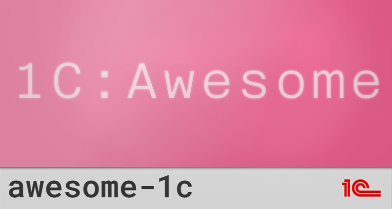

---
awesome-1c
---

## Контент

- [Статьи](#статьи)
- [Обучение](#обучение)
- [БСП](#бсп)
- [Конфигурации](#конфигурации)
- [Интеграции](#интеграции)
- [Утилиты](#утилиты)
- [Сообщество](#сообщество)

## Статьи

## Обучение

## БСП

- [Стандарты разработки](https://its.1c.ru/db/v8std)
- [Из чего состоит БСП и какие задачи решает?](http://v8.1c.ru/libraries/ssl/index.htm)
- [Документация БСП](https://its.1c.ru/db/bsp311doc)

## Конфигурации

## Интеграции

## Утилиты

## Сообщество

### Чаты

- [SilverBulleters Community](https://t.me/ssl1c) - Обсуждаем инженерные практики для 1С, тестирование, DevOps и CI/CD, статический анализ кода, качество решений 1С и т.п.
- [1С, БСП, DevOps и Архитектура](https://t.me/silvernation) - Не официальная группа 1С, БСП, DevOps и Архитектура
- [1C:Family](https://t.me/fam1c) - Чятик без премодерации

### Каналы
- [1С:БСП](https://t.me/learn_ssl1c) -Не официальный канал БСП.
- [Бухучет, налоги, 1С](https://t.me/buhru) - Канал для бухгалтеров и пользователей 1С - бухгалтерия, налоги, новое в программах 1С.
- [1С: Работа](https://t.me/joboneC) - Вакансии 1С. Резюме 1С. Без цензуры.
- [1С+web+mobile+etc](https://t.me/web_mobile_1C) - 1С+web+mobile+etc
- [OneSCast](https://t.me/OneSCast) - Лайфхаки для разработчика (и не только) по работе в 1С:Предприятии 8 и 1С:EDT.
- [1С wiki](https://t.me/wiki1c) - Про 1С и не только
- [1С:ERP - Ваш Консультант](https://t.me/consultant_1c) - Установка, настройка, сопровождение программ 1С:ERP, 1С:УНФ, УТ, БП, ЗиУП, ДО. 
- [1С: FUN](https://t.me/jokes1c) - 1С. Всё гораздо лучше чем есть на самом деле.

